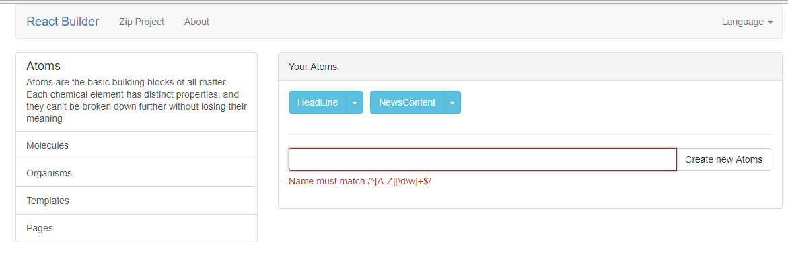
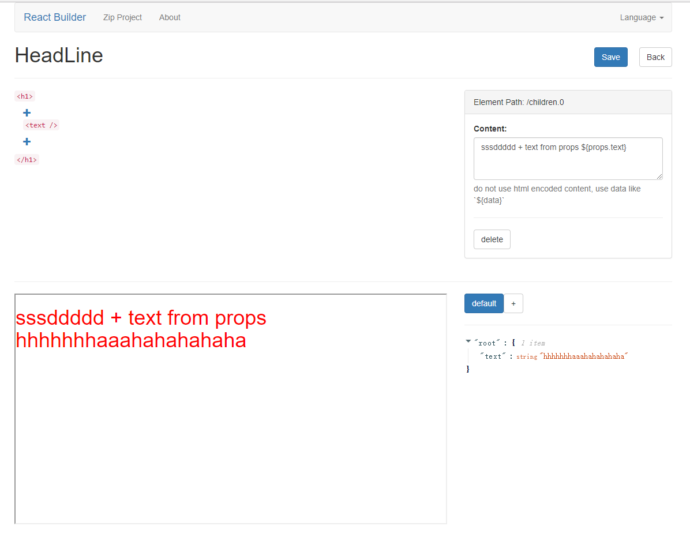
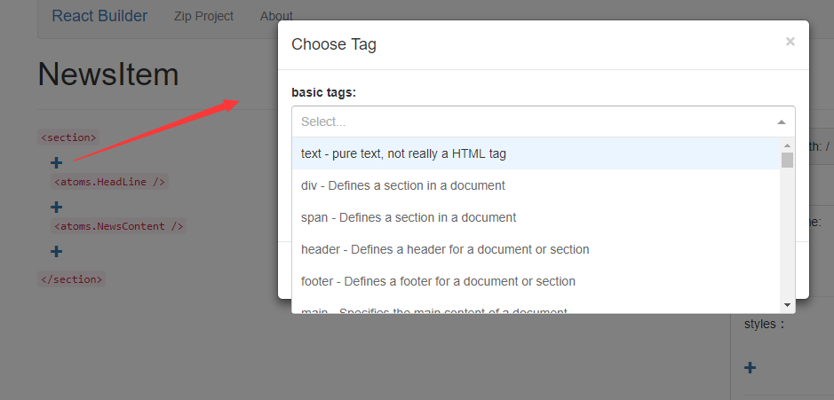
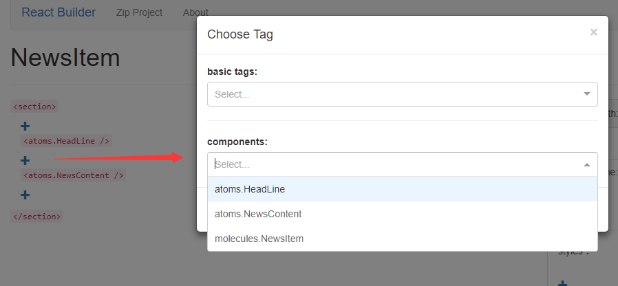
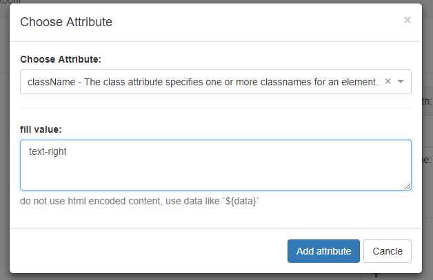
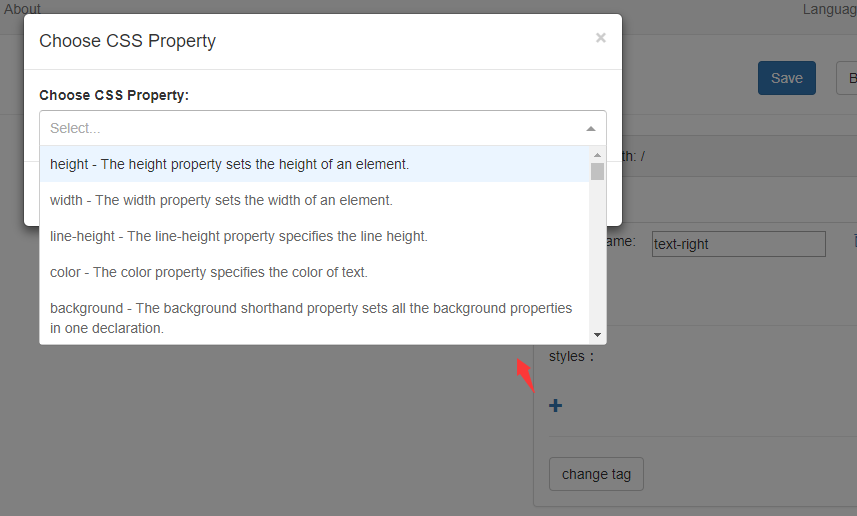
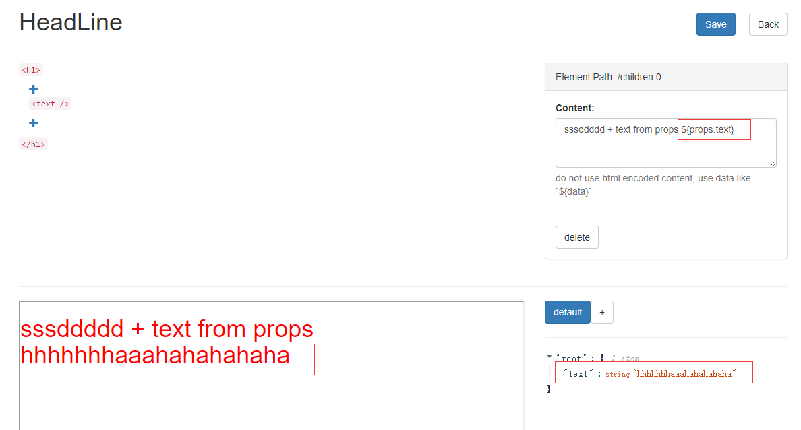
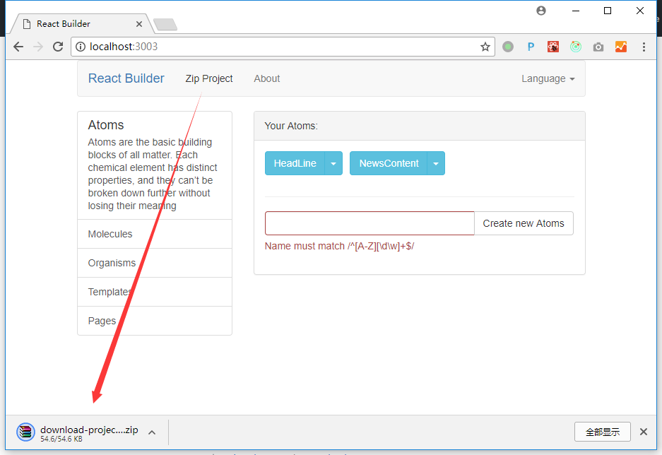

# react builder

一个给前端和设计人员使用的原型工具，通过Web编辑器创建React项目

[English](./docs/README.md)

## 创建本项目的初衷

在你开始你的React网站之前，最好是有一个原型来预览一下你的网站工作起来会是什么样子的。大多数情况下这个原型是没有的，有些时候这个原型是丑陋到无法表现内容的，还有的时候花了很大的力气做了原型又根本无法用在后面的开发中。如果有一个工具能够像 [sketch](https://www.sketchapp.com/) 一样来制作网站原型，而且又能直接交给后续的开发使用呢？所以我尝试做了这个项目

## 使用方法

```
git clone https://github.com/postor/react-builder.git
cd react-builder
npm install
npm run dev
start http://localhost:3003
```

## 特性

- 原子设计
- 编辑器和预览
- 组件嵌套和HTML嵌套
- HTML元素的属性和样式编辑
- 通过json配置props预览组件
- 导出React项目
- 向嵌套的组件传递props
- if/for及定制逻辑的实现 


### 原子设计



### 编辑器和预览

预览还是有点慢，但会更新的



### 组件嵌套

HTML嵌套



组件嵌套



### HTML属性和样式

添加类名



添加样式



### 通过JSON配置组件预览

JSON props



### 导出项目

打包项目并下载, 导出的项目基于 [next.js](https://github.com/zeit/next.js/)



要运行这个项目请确保在`pages`下有`Index` 组件 

```
mkdir project_root
unzip project.zip ./project_root/
cd project_root
npm install
npm run dev
start http://localhost/
```

## 使用视频预览

[](https://www.youtube.com/watch?v=_JzSke7zQ7c)

基于 https://github.com/nextjs-boilerplate/next.js-boilerplate

